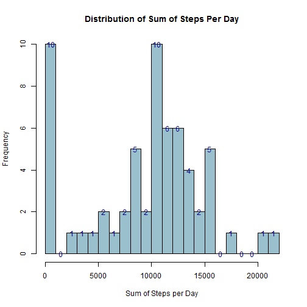
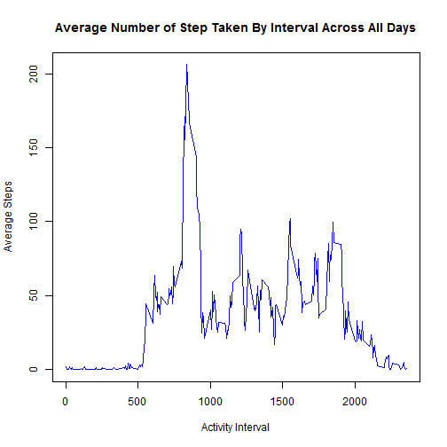
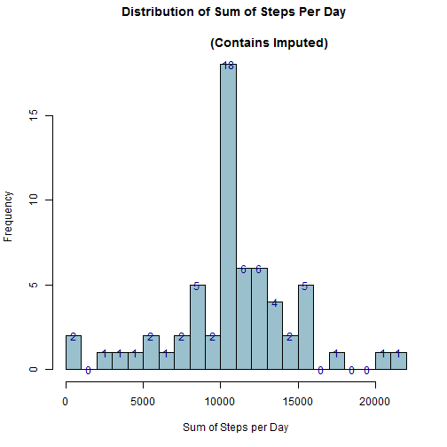
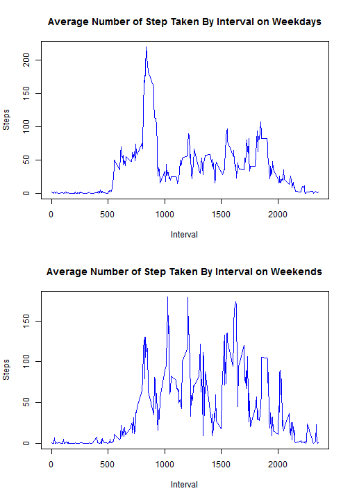

**1.0 Load "R" Libraries**

- dplyr 
- lubridate 
- xtable 

```r
library(dplyr)
library(lubridate)
library(xtable)
```


**1.1 Download "activity data"" zip file to working directory** 

Note: Script only downloads the zip file it it does not already exist in the
current workding directory.


```r
if(!file.exists("repdata-data-activity.zip")) {
        print("downloading...")
        zipfile <- tempfile()
        download.file("https://d396qusza40orc.cloudfront.net/repdata%2Fdata%2Factivity.zip", zipfile)
} else {
        zipfile <- "repdata-data-activity.zip" 
}
```


**1.2 Read the file from the archive (i.e. don't explode it)**

Also, coerces date in *activity* dataframe into a date object. 


```r
activity <- read.csv(unz(zipfile, "activity.csv"), 
                     header=TRUE, 
                     sep =",",
                     na.strings="NA",
                     stringsAsFactors=TRUE)


activity$date <- ymd(activity$date)
```

**2.0 What is mean total number of steps taken per day?**

The activity data contains observations for one individual.

To answer this question, ...  
- Grouped steps by date  
- Summed steps by the date grouping  
- Ignored missing values per project directions   
- Created a histogram of sum of step by day  
- Added the frequency as text to each bin for added readability 


```r
activity_sum_by_date <- activity %>%
        group_by(date) %>%
        summarize(sum(steps, na.rm=TRUE))

names(activity_sum_by_date) <- c("Date", "Steps")

bins <- hist(activity_sum_by_date$Steps, 
             breaks=20, col="lightblue3", 
             xlab="Sum of Steps per Day", 
             main="Distribution of Sum of Steps Per Day" )

text(x=bins$mids, 
     y=bins$count,
     label=bins$count,
     col="darkblue",
     font=1)
```

 

Compute and show Sum, Mean and Median Steps by Date.

- Create mean dataset
- Create median dataset
- Bound the columns of sum dataset (from previous step) with the mean and median datasets 
- Write output to HTML table below


```r
names(activity_sum_by_date) <- c("Date", "Sum")

activity_mean_by_date <- activity %>%
        group_by(date) %>%
        summarize(mean(steps, na.rm=TRUE))

names(activity_mean_by_date) <- c("Date", "Mean")

activity_median_by_date <- activity %>%
        group_by(date) %>%
        summarize(median(steps, na.rm=TRUE))

names(activity_median_by_date) <- c("Date", "Median")

step_stats_by_date <- cbind(activity_sum_by_date, 
                            activity_mean_by_date$Mean, 
                            activity_median_by_date$Median)

names(step_stats_by_date) <- c("Date", "Sum", "Mean", "Median")
step_stats_by_date$Date <- format(step_stats_by_date$Date, format="%B %d %Y")
xt <- xtable(step_stats_by_date)
print(xt, type="html")
```

<!-- html table generated in R 3.1.2 by xtable 1.7-4 package -->
<!-- Sun May 17 11:12:47 2015 -->
<table border=1>
<tr> <th>  </th> <th> Date </th> <th> Sum </th> <th> Mean </th> <th> Median </th>  </tr>
  <tr> <td align="right"> 1 </td> <td> October 01 2012 </td> <td align="right">   0 </td> <td align="right">  </td> <td align="right">  </td> </tr>
  <tr> <td align="right"> 2 </td> <td> October 02 2012 </td> <td align="right"> 126 </td> <td align="right"> 0.44 </td> <td align="right"> 0.00 </td> </tr>
  <tr> <td align="right"> 3 </td> <td> October 03 2012 </td> <td align="right"> 11352 </td> <td align="right"> 39.42 </td> <td align="right"> 0.00 </td> </tr>
  <tr> <td align="right"> 4 </td> <td> October 04 2012 </td> <td align="right"> 12116 </td> <td align="right"> 42.07 </td> <td align="right"> 0.00 </td> </tr>
  <tr> <td align="right"> 5 </td> <td> October 05 2012 </td> <td align="right"> 13294 </td> <td align="right"> 46.16 </td> <td align="right"> 0.00 </td> </tr>
  <tr> <td align="right"> 6 </td> <td> October 06 2012 </td> <td align="right"> 15420 </td> <td align="right"> 53.54 </td> <td align="right"> 0.00 </td> </tr>
  <tr> <td align="right"> 7 </td> <td> October 07 2012 </td> <td align="right"> 11015 </td> <td align="right"> 38.25 </td> <td align="right"> 0.00 </td> </tr>
  <tr> <td align="right"> 8 </td> <td> October 08 2012 </td> <td align="right">   0 </td> <td align="right">  </td> <td align="right">  </td> </tr>
  <tr> <td align="right"> 9 </td> <td> October 09 2012 </td> <td align="right"> 12811 </td> <td align="right"> 44.48 </td> <td align="right"> 0.00 </td> </tr>
  <tr> <td align="right"> 10 </td> <td> October 10 2012 </td> <td align="right"> 9900 </td> <td align="right"> 34.38 </td> <td align="right"> 0.00 </td> </tr>
  <tr> <td align="right"> 11 </td> <td> October 11 2012 </td> <td align="right"> 10304 </td> <td align="right"> 35.78 </td> <td align="right"> 0.00 </td> </tr>
  <tr> <td align="right"> 12 </td> <td> October 12 2012 </td> <td align="right"> 17382 </td> <td align="right"> 60.35 </td> <td align="right"> 0.00 </td> </tr>
  <tr> <td align="right"> 13 </td> <td> October 13 2012 </td> <td align="right"> 12426 </td> <td align="right"> 43.15 </td> <td align="right"> 0.00 </td> </tr>
  <tr> <td align="right"> 14 </td> <td> October 14 2012 </td> <td align="right"> 15098 </td> <td align="right"> 52.42 </td> <td align="right"> 0.00 </td> </tr>
  <tr> <td align="right"> 15 </td> <td> October 15 2012 </td> <td align="right"> 10139 </td> <td align="right"> 35.20 </td> <td align="right"> 0.00 </td> </tr>
  <tr> <td align="right"> 16 </td> <td> October 16 2012 </td> <td align="right"> 15084 </td> <td align="right"> 52.38 </td> <td align="right"> 0.00 </td> </tr>
  <tr> <td align="right"> 17 </td> <td> October 17 2012 </td> <td align="right"> 13452 </td> <td align="right"> 46.71 </td> <td align="right"> 0.00 </td> </tr>
  <tr> <td align="right"> 18 </td> <td> October 18 2012 </td> <td align="right"> 10056 </td> <td align="right"> 34.92 </td> <td align="right"> 0.00 </td> </tr>
  <tr> <td align="right"> 19 </td> <td> October 19 2012 </td> <td align="right"> 11829 </td> <td align="right"> 41.07 </td> <td align="right"> 0.00 </td> </tr>
  <tr> <td align="right"> 20 </td> <td> October 20 2012 </td> <td align="right"> 10395 </td> <td align="right"> 36.09 </td> <td align="right"> 0.00 </td> </tr>
  <tr> <td align="right"> 21 </td> <td> October 21 2012 </td> <td align="right"> 8821 </td> <td align="right"> 30.63 </td> <td align="right"> 0.00 </td> </tr>
  <tr> <td align="right"> 22 </td> <td> October 22 2012 </td> <td align="right"> 13460 </td> <td align="right"> 46.74 </td> <td align="right"> 0.00 </td> </tr>
  <tr> <td align="right"> 23 </td> <td> October 23 2012 </td> <td align="right"> 8918 </td> <td align="right"> 30.97 </td> <td align="right"> 0.00 </td> </tr>
  <tr> <td align="right"> 24 </td> <td> October 24 2012 </td> <td align="right"> 8355 </td> <td align="right"> 29.01 </td> <td align="right"> 0.00 </td> </tr>
  <tr> <td align="right"> 25 </td> <td> October 25 2012 </td> <td align="right"> 2492 </td> <td align="right"> 8.65 </td> <td align="right"> 0.00 </td> </tr>
  <tr> <td align="right"> 26 </td> <td> October 26 2012 </td> <td align="right"> 6778 </td> <td align="right"> 23.53 </td> <td align="right"> 0.00 </td> </tr>
  <tr> <td align="right"> 27 </td> <td> October 27 2012 </td> <td align="right"> 10119 </td> <td align="right"> 35.14 </td> <td align="right"> 0.00 </td> </tr>
  <tr> <td align="right"> 28 </td> <td> October 28 2012 </td> <td align="right"> 11458 </td> <td align="right"> 39.78 </td> <td align="right"> 0.00 </td> </tr>
  <tr> <td align="right"> 29 </td> <td> October 29 2012 </td> <td align="right"> 5018 </td> <td align="right"> 17.42 </td> <td align="right"> 0.00 </td> </tr>
  <tr> <td align="right"> 30 </td> <td> October 30 2012 </td> <td align="right"> 9819 </td> <td align="right"> 34.09 </td> <td align="right"> 0.00 </td> </tr>
  <tr> <td align="right"> 31 </td> <td> October 31 2012 </td> <td align="right"> 15414 </td> <td align="right"> 53.52 </td> <td align="right"> 0.00 </td> </tr>
  <tr> <td align="right"> 32 </td> <td> November 01 2012 </td> <td align="right">   0 </td> <td align="right">  </td> <td align="right">  </td> </tr>
  <tr> <td align="right"> 33 </td> <td> November 02 2012 </td> <td align="right"> 10600 </td> <td align="right"> 36.81 </td> <td align="right"> 0.00 </td> </tr>
  <tr> <td align="right"> 34 </td> <td> November 03 2012 </td> <td align="right"> 10571 </td> <td align="right"> 36.70 </td> <td align="right"> 0.00 </td> </tr>
  <tr> <td align="right"> 35 </td> <td> November 04 2012 </td> <td align="right">   0 </td> <td align="right">  </td> <td align="right">  </td> </tr>
  <tr> <td align="right"> 36 </td> <td> November 05 2012 </td> <td align="right"> 10439 </td> <td align="right"> 36.25 </td> <td align="right"> 0.00 </td> </tr>
  <tr> <td align="right"> 37 </td> <td> November 06 2012 </td> <td align="right"> 8334 </td> <td align="right"> 28.94 </td> <td align="right"> 0.00 </td> </tr>
  <tr> <td align="right"> 38 </td> <td> November 07 2012 </td> <td align="right"> 12883 </td> <td align="right"> 44.73 </td> <td align="right"> 0.00 </td> </tr>
  <tr> <td align="right"> 39 </td> <td> November 08 2012 </td> <td align="right"> 3219 </td> <td align="right"> 11.18 </td> <td align="right"> 0.00 </td> </tr>
  <tr> <td align="right"> 40 </td> <td> November 09 2012 </td> <td align="right">   0 </td> <td align="right">  </td> <td align="right">  </td> </tr>
  <tr> <td align="right"> 41 </td> <td> November 10 2012 </td> <td align="right">   0 </td> <td align="right">  </td> <td align="right">  </td> </tr>
  <tr> <td align="right"> 42 </td> <td> November 11 2012 </td> <td align="right"> 12608 </td> <td align="right"> 43.78 </td> <td align="right"> 0.00 </td> </tr>
  <tr> <td align="right"> 43 </td> <td> November 12 2012 </td> <td align="right"> 10765 </td> <td align="right"> 37.38 </td> <td align="right"> 0.00 </td> </tr>
  <tr> <td align="right"> 44 </td> <td> November 13 2012 </td> <td align="right"> 7336 </td> <td align="right"> 25.47 </td> <td align="right"> 0.00 </td> </tr>
  <tr> <td align="right"> 45 </td> <td> November 14 2012 </td> <td align="right">   0 </td> <td align="right">  </td> <td align="right">  </td> </tr>
  <tr> <td align="right"> 46 </td> <td> November 15 2012 </td> <td align="right">  41 </td> <td align="right"> 0.14 </td> <td align="right"> 0.00 </td> </tr>
  <tr> <td align="right"> 47 </td> <td> November 16 2012 </td> <td align="right"> 5441 </td> <td align="right"> 18.89 </td> <td align="right"> 0.00 </td> </tr>
  <tr> <td align="right"> 48 </td> <td> November 17 2012 </td> <td align="right"> 14339 </td> <td align="right"> 49.79 </td> <td align="right"> 0.00 </td> </tr>
  <tr> <td align="right"> 49 </td> <td> November 18 2012 </td> <td align="right"> 15110 </td> <td align="right"> 52.47 </td> <td align="right"> 0.00 </td> </tr>
  <tr> <td align="right"> 50 </td> <td> November 19 2012 </td> <td align="right"> 8841 </td> <td align="right"> 30.70 </td> <td align="right"> 0.00 </td> </tr>
  <tr> <td align="right"> 51 </td> <td> November 20 2012 </td> <td align="right"> 4472 </td> <td align="right"> 15.53 </td> <td align="right"> 0.00 </td> </tr>
  <tr> <td align="right"> 52 </td> <td> November 21 2012 </td> <td align="right"> 12787 </td> <td align="right"> 44.40 </td> <td align="right"> 0.00 </td> </tr>
  <tr> <td align="right"> 53 </td> <td> November 22 2012 </td> <td align="right"> 20427 </td> <td align="right"> 70.93 </td> <td align="right"> 0.00 </td> </tr>
  <tr> <td align="right"> 54 </td> <td> November 23 2012 </td> <td align="right"> 21194 </td> <td align="right"> 73.59 </td> <td align="right"> 0.00 </td> </tr>
  <tr> <td align="right"> 55 </td> <td> November 24 2012 </td> <td align="right"> 14478 </td> <td align="right"> 50.27 </td> <td align="right"> 0.00 </td> </tr>
  <tr> <td align="right"> 56 </td> <td> November 25 2012 </td> <td align="right"> 11834 </td> <td align="right"> 41.09 </td> <td align="right"> 0.00 </td> </tr>
  <tr> <td align="right"> 57 </td> <td> November 26 2012 </td> <td align="right"> 11162 </td> <td align="right"> 38.76 </td> <td align="right"> 0.00 </td> </tr>
  <tr> <td align="right"> 58 </td> <td> November 27 2012 </td> <td align="right"> 13646 </td> <td align="right"> 47.38 </td> <td align="right"> 0.00 </td> </tr>
  <tr> <td align="right"> 59 </td> <td> November 28 2012 </td> <td align="right"> 10183 </td> <td align="right"> 35.36 </td> <td align="right"> 0.00 </td> </tr>
  <tr> <td align="right"> 60 </td> <td> November 29 2012 </td> <td align="right"> 7047 </td> <td align="right"> 24.47 </td> <td align="right"> 0.00 </td> </tr>
  <tr> <td align="right"> 61 </td> <td> November 30 2012 </td> <td align="right">   0 </td> <td align="right">  </td> <td align="right">  </td> </tr>
   </table>


**3.0 What is the average daily activity pattern?**

Work is performed in sub-sections 3.1 and 3.2

**3.1 Make a time series plot (i.e. type = "l" ) of the 5 minute interval (xaxis) and the average number of steps taken, averaged across all days (yaxis)**

- Grouped steps by interval    
- Computed mean of steps by the interval grouping   
- Ignored missing values per project directions     
- Created a time series plot of the of sum of step mean by intervals  

```r
activity_avg_by_interval <- activity %>%
        group_by(interval) %>% 
        summarize(mean(steps, na.rm=TRUE))

names(activity_avg_by_interval) <- c("Interval", "Mean")

plot(activity_avg_by_interval$Interval, 
     activity_avg_by_interval$Mean, 
     type="l",
     col="blue",
     xlab="Activity Interval", 
     ylab="Average Steps",
     main="Average Number of Step Taken By Interval Across All Days")
```

 


**3.2 Which 5 minute interval, on average across all the days in the dataset, contains the maximum number of steps?**

Simply grabbed the max mean and printed it to a table below.  

```r
xt <- xtable(activity_avg_by_interval[which.max(activity_avg_by_interval$Mean),])
print(xt,"html")
```

<!-- html table generated in R 3.1.2 by xtable 1.7-4 package -->
<!-- Sun May 17 11:12:47 2015 -->
<table border=1>
<tr> <th>  </th> <th> Interval </th> <th> Mean </th>  </tr>
  <tr> <td align="right"> 1 </td> <td align="right"> 835 </td> <td align="right"> 206.17 </td> </tr>
   </table>


**4.0 Imputing missing values**

Work is performed in sub-sections 4.1 through 4.4.

**4.1 Calculate and report the total number of missing values in the dataset (i.e. the total number of rows with NA's)**

Subsetted the rows with steps equal to NA and got a row count.  

```r
activity_na_steps <- subset(activity, is.na(activity$steps))
nrow(activity_na_steps)
```

```
## [1] 2304
```


**4.2. Devise a strategy for filling in all of the missing values in the dataset.** 
 
Interestingly, the number of NA's per interval is evenly distributed (i.e. 8 per interval) 
- Took the subset from the previous step and grouped them by interval  
- Used summarize to get the count for each interval  
- Created a table of this summarization 
- Wrote it to html  


```r
activity_na_sum_by_interval <- activity_na_steps %>%
        group_by(interval) %>%
        summarize(n())

xt <- xtable(activity_na_sum_by_interval)
print(xt,"html")
```

<!-- html table generated in R 3.1.2 by xtable 1.7-4 package -->
<!-- Sun May 17 11:12:48 2015 -->
<table border=1>
<tr> <th>  </th> <th> interval </th> <th> n() </th>  </tr>
  <tr> <td align="right"> 1 </td> <td align="right">   0 </td> <td align="right">   8 </td> </tr>
  <tr> <td align="right"> 2 </td> <td align="right">   5 </td> <td align="right">   8 </td> </tr>
  <tr> <td align="right"> 3 </td> <td align="right">  10 </td> <td align="right">   8 </td> </tr>
  <tr> <td align="right"> 4 </td> <td align="right">  15 </td> <td align="right">   8 </td> </tr>
  <tr> <td align="right"> 5 </td> <td align="right">  20 </td> <td align="right">   8 </td> </tr>
  <tr> <td align="right"> 6 </td> <td align="right">  25 </td> <td align="right">   8 </td> </tr>
  <tr> <td align="right"> 7 </td> <td align="right">  30 </td> <td align="right">   8 </td> </tr>
  <tr> <td align="right"> 8 </td> <td align="right">  35 </td> <td align="right">   8 </td> </tr>
  <tr> <td align="right"> 9 </td> <td align="right">  40 </td> <td align="right">   8 </td> </tr>
  <tr> <td align="right"> 10 </td> <td align="right">  45 </td> <td align="right">   8 </td> </tr>
  <tr> <td align="right"> 11 </td> <td align="right">  50 </td> <td align="right">   8 </td> </tr>
  <tr> <td align="right"> 12 </td> <td align="right">  55 </td> <td align="right">   8 </td> </tr>
  <tr> <td align="right"> 13 </td> <td align="right"> 100 </td> <td align="right">   8 </td> </tr>
  <tr> <td align="right"> 14 </td> <td align="right"> 105 </td> <td align="right">   8 </td> </tr>
  <tr> <td align="right"> 15 </td> <td align="right"> 110 </td> <td align="right">   8 </td> </tr>
  <tr> <td align="right"> 16 </td> <td align="right"> 115 </td> <td align="right">   8 </td> </tr>
  <tr> <td align="right"> 17 </td> <td align="right"> 120 </td> <td align="right">   8 </td> </tr>
  <tr> <td align="right"> 18 </td> <td align="right"> 125 </td> <td align="right">   8 </td> </tr>
  <tr> <td align="right"> 19 </td> <td align="right"> 130 </td> <td align="right">   8 </td> </tr>
  <tr> <td align="right"> 20 </td> <td align="right"> 135 </td> <td align="right">   8 </td> </tr>
  <tr> <td align="right"> 21 </td> <td align="right"> 140 </td> <td align="right">   8 </td> </tr>
  <tr> <td align="right"> 22 </td> <td align="right"> 145 </td> <td align="right">   8 </td> </tr>
  <tr> <td align="right"> 23 </td> <td align="right"> 150 </td> <td align="right">   8 </td> </tr>
  <tr> <td align="right"> 24 </td> <td align="right"> 155 </td> <td align="right">   8 </td> </tr>
  <tr> <td align="right"> 25 </td> <td align="right"> 200 </td> <td align="right">   8 </td> </tr>
  <tr> <td align="right"> 26 </td> <td align="right"> 205 </td> <td align="right">   8 </td> </tr>
  <tr> <td align="right"> 27 </td> <td align="right"> 210 </td> <td align="right">   8 </td> </tr>
  <tr> <td align="right"> 28 </td> <td align="right"> 215 </td> <td align="right">   8 </td> </tr>
  <tr> <td align="right"> 29 </td> <td align="right"> 220 </td> <td align="right">   8 </td> </tr>
  <tr> <td align="right"> 30 </td> <td align="right"> 225 </td> <td align="right">   8 </td> </tr>
  <tr> <td align="right"> 31 </td> <td align="right"> 230 </td> <td align="right">   8 </td> </tr>
  <tr> <td align="right"> 32 </td> <td align="right"> 235 </td> <td align="right">   8 </td> </tr>
  <tr> <td align="right"> 33 </td> <td align="right"> 240 </td> <td align="right">   8 </td> </tr>
  <tr> <td align="right"> 34 </td> <td align="right"> 245 </td> <td align="right">   8 </td> </tr>
  <tr> <td align="right"> 35 </td> <td align="right"> 250 </td> <td align="right">   8 </td> </tr>
  <tr> <td align="right"> 36 </td> <td align="right"> 255 </td> <td align="right">   8 </td> </tr>
  <tr> <td align="right"> 37 </td> <td align="right"> 300 </td> <td align="right">   8 </td> </tr>
  <tr> <td align="right"> 38 </td> <td align="right"> 305 </td> <td align="right">   8 </td> </tr>
  <tr> <td align="right"> 39 </td> <td align="right"> 310 </td> <td align="right">   8 </td> </tr>
  <tr> <td align="right"> 40 </td> <td align="right"> 315 </td> <td align="right">   8 </td> </tr>
  <tr> <td align="right"> 41 </td> <td align="right"> 320 </td> <td align="right">   8 </td> </tr>
  <tr> <td align="right"> 42 </td> <td align="right"> 325 </td> <td align="right">   8 </td> </tr>
  <tr> <td align="right"> 43 </td> <td align="right"> 330 </td> <td align="right">   8 </td> </tr>
  <tr> <td align="right"> 44 </td> <td align="right"> 335 </td> <td align="right">   8 </td> </tr>
  <tr> <td align="right"> 45 </td> <td align="right"> 340 </td> <td align="right">   8 </td> </tr>
  <tr> <td align="right"> 46 </td> <td align="right"> 345 </td> <td align="right">   8 </td> </tr>
  <tr> <td align="right"> 47 </td> <td align="right"> 350 </td> <td align="right">   8 </td> </tr>
  <tr> <td align="right"> 48 </td> <td align="right"> 355 </td> <td align="right">   8 </td> </tr>
  <tr> <td align="right"> 49 </td> <td align="right"> 400 </td> <td align="right">   8 </td> </tr>
  <tr> <td align="right"> 50 </td> <td align="right"> 405 </td> <td align="right">   8 </td> </tr>
  <tr> <td align="right"> 51 </td> <td align="right"> 410 </td> <td align="right">   8 </td> </tr>
  <tr> <td align="right"> 52 </td> <td align="right"> 415 </td> <td align="right">   8 </td> </tr>
  <tr> <td align="right"> 53 </td> <td align="right"> 420 </td> <td align="right">   8 </td> </tr>
  <tr> <td align="right"> 54 </td> <td align="right"> 425 </td> <td align="right">   8 </td> </tr>
  <tr> <td align="right"> 55 </td> <td align="right"> 430 </td> <td align="right">   8 </td> </tr>
  <tr> <td align="right"> 56 </td> <td align="right"> 435 </td> <td align="right">   8 </td> </tr>
  <tr> <td align="right"> 57 </td> <td align="right"> 440 </td> <td align="right">   8 </td> </tr>
  <tr> <td align="right"> 58 </td> <td align="right"> 445 </td> <td align="right">   8 </td> </tr>
  <tr> <td align="right"> 59 </td> <td align="right"> 450 </td> <td align="right">   8 </td> </tr>
  <tr> <td align="right"> 60 </td> <td align="right"> 455 </td> <td align="right">   8 </td> </tr>
  <tr> <td align="right"> 61 </td> <td align="right"> 500 </td> <td align="right">   8 </td> </tr>
  <tr> <td align="right"> 62 </td> <td align="right"> 505 </td> <td align="right">   8 </td> </tr>
  <tr> <td align="right"> 63 </td> <td align="right"> 510 </td> <td align="right">   8 </td> </tr>
  <tr> <td align="right"> 64 </td> <td align="right"> 515 </td> <td align="right">   8 </td> </tr>
  <tr> <td align="right"> 65 </td> <td align="right"> 520 </td> <td align="right">   8 </td> </tr>
  <tr> <td align="right"> 66 </td> <td align="right"> 525 </td> <td align="right">   8 </td> </tr>
  <tr> <td align="right"> 67 </td> <td align="right"> 530 </td> <td align="right">   8 </td> </tr>
  <tr> <td align="right"> 68 </td> <td align="right"> 535 </td> <td align="right">   8 </td> </tr>
  <tr> <td align="right"> 69 </td> <td align="right"> 540 </td> <td align="right">   8 </td> </tr>
  <tr> <td align="right"> 70 </td> <td align="right"> 545 </td> <td align="right">   8 </td> </tr>
  <tr> <td align="right"> 71 </td> <td align="right"> 550 </td> <td align="right">   8 </td> </tr>
  <tr> <td align="right"> 72 </td> <td align="right"> 555 </td> <td align="right">   8 </td> </tr>
  <tr> <td align="right"> 73 </td> <td align="right"> 600 </td> <td align="right">   8 </td> </tr>
  <tr> <td align="right"> 74 </td> <td align="right"> 605 </td> <td align="right">   8 </td> </tr>
  <tr> <td align="right"> 75 </td> <td align="right"> 610 </td> <td align="right">   8 </td> </tr>
  <tr> <td align="right"> 76 </td> <td align="right"> 615 </td> <td align="right">   8 </td> </tr>
  <tr> <td align="right"> 77 </td> <td align="right"> 620 </td> <td align="right">   8 </td> </tr>
  <tr> <td align="right"> 78 </td> <td align="right"> 625 </td> <td align="right">   8 </td> </tr>
  <tr> <td align="right"> 79 </td> <td align="right"> 630 </td> <td align="right">   8 </td> </tr>
  <tr> <td align="right"> 80 </td> <td align="right"> 635 </td> <td align="right">   8 </td> </tr>
  <tr> <td align="right"> 81 </td> <td align="right"> 640 </td> <td align="right">   8 </td> </tr>
  <tr> <td align="right"> 82 </td> <td align="right"> 645 </td> <td align="right">   8 </td> </tr>
  <tr> <td align="right"> 83 </td> <td align="right"> 650 </td> <td align="right">   8 </td> </tr>
  <tr> <td align="right"> 84 </td> <td align="right"> 655 </td> <td align="right">   8 </td> </tr>
  <tr> <td align="right"> 85 </td> <td align="right"> 700 </td> <td align="right">   8 </td> </tr>
  <tr> <td align="right"> 86 </td> <td align="right"> 705 </td> <td align="right">   8 </td> </tr>
  <tr> <td align="right"> 87 </td> <td align="right"> 710 </td> <td align="right">   8 </td> </tr>
  <tr> <td align="right"> 88 </td> <td align="right"> 715 </td> <td align="right">   8 </td> </tr>
  <tr> <td align="right"> 89 </td> <td align="right"> 720 </td> <td align="right">   8 </td> </tr>
  <tr> <td align="right"> 90 </td> <td align="right"> 725 </td> <td align="right">   8 </td> </tr>
  <tr> <td align="right"> 91 </td> <td align="right"> 730 </td> <td align="right">   8 </td> </tr>
  <tr> <td align="right"> 92 </td> <td align="right"> 735 </td> <td align="right">   8 </td> </tr>
  <tr> <td align="right"> 93 </td> <td align="right"> 740 </td> <td align="right">   8 </td> </tr>
  <tr> <td align="right"> 94 </td> <td align="right"> 745 </td> <td align="right">   8 </td> </tr>
  <tr> <td align="right"> 95 </td> <td align="right"> 750 </td> <td align="right">   8 </td> </tr>
  <tr> <td align="right"> 96 </td> <td align="right"> 755 </td> <td align="right">   8 </td> </tr>
  <tr> <td align="right"> 97 </td> <td align="right"> 800 </td> <td align="right">   8 </td> </tr>
  <tr> <td align="right"> 98 </td> <td align="right"> 805 </td> <td align="right">   8 </td> </tr>
  <tr> <td align="right"> 99 </td> <td align="right"> 810 </td> <td align="right">   8 </td> </tr>
  <tr> <td align="right"> 100 </td> <td align="right"> 815 </td> <td align="right">   8 </td> </tr>
  <tr> <td align="right"> 101 </td> <td align="right"> 820 </td> <td align="right">   8 </td> </tr>
  <tr> <td align="right"> 102 </td> <td align="right"> 825 </td> <td align="right">   8 </td> </tr>
  <tr> <td align="right"> 103 </td> <td align="right"> 830 </td> <td align="right">   8 </td> </tr>
  <tr> <td align="right"> 104 </td> <td align="right"> 835 </td> <td align="right">   8 </td> </tr>
  <tr> <td align="right"> 105 </td> <td align="right"> 840 </td> <td align="right">   8 </td> </tr>
  <tr> <td align="right"> 106 </td> <td align="right"> 845 </td> <td align="right">   8 </td> </tr>
  <tr> <td align="right"> 107 </td> <td align="right"> 850 </td> <td align="right">   8 </td> </tr>
  <tr> <td align="right"> 108 </td> <td align="right"> 855 </td> <td align="right">   8 </td> </tr>
  <tr> <td align="right"> 109 </td> <td align="right"> 900 </td> <td align="right">   8 </td> </tr>
  <tr> <td align="right"> 110 </td> <td align="right"> 905 </td> <td align="right">   8 </td> </tr>
  <tr> <td align="right"> 111 </td> <td align="right"> 910 </td> <td align="right">   8 </td> </tr>
  <tr> <td align="right"> 112 </td> <td align="right"> 915 </td> <td align="right">   8 </td> </tr>
  <tr> <td align="right"> 113 </td> <td align="right"> 920 </td> <td align="right">   8 </td> </tr>
  <tr> <td align="right"> 114 </td> <td align="right"> 925 </td> <td align="right">   8 </td> </tr>
  <tr> <td align="right"> 115 </td> <td align="right"> 930 </td> <td align="right">   8 </td> </tr>
  <tr> <td align="right"> 116 </td> <td align="right"> 935 </td> <td align="right">   8 </td> </tr>
  <tr> <td align="right"> 117 </td> <td align="right"> 940 </td> <td align="right">   8 </td> </tr>
  <tr> <td align="right"> 118 </td> <td align="right"> 945 </td> <td align="right">   8 </td> </tr>
  <tr> <td align="right"> 119 </td> <td align="right"> 950 </td> <td align="right">   8 </td> </tr>
  <tr> <td align="right"> 120 </td> <td align="right"> 955 </td> <td align="right">   8 </td> </tr>
  <tr> <td align="right"> 121 </td> <td align="right"> 1000 </td> <td align="right">   8 </td> </tr>
  <tr> <td align="right"> 122 </td> <td align="right"> 1005 </td> <td align="right">   8 </td> </tr>
  <tr> <td align="right"> 123 </td> <td align="right"> 1010 </td> <td align="right">   8 </td> </tr>
  <tr> <td align="right"> 124 </td> <td align="right"> 1015 </td> <td align="right">   8 </td> </tr>
  <tr> <td align="right"> 125 </td> <td align="right"> 1020 </td> <td align="right">   8 </td> </tr>
  <tr> <td align="right"> 126 </td> <td align="right"> 1025 </td> <td align="right">   8 </td> </tr>
  <tr> <td align="right"> 127 </td> <td align="right"> 1030 </td> <td align="right">   8 </td> </tr>
  <tr> <td align="right"> 128 </td> <td align="right"> 1035 </td> <td align="right">   8 </td> </tr>
  <tr> <td align="right"> 129 </td> <td align="right"> 1040 </td> <td align="right">   8 </td> </tr>
  <tr> <td align="right"> 130 </td> <td align="right"> 1045 </td> <td align="right">   8 </td> </tr>
  <tr> <td align="right"> 131 </td> <td align="right"> 1050 </td> <td align="right">   8 </td> </tr>
  <tr> <td align="right"> 132 </td> <td align="right"> 1055 </td> <td align="right">   8 </td> </tr>
  <tr> <td align="right"> 133 </td> <td align="right"> 1100 </td> <td align="right">   8 </td> </tr>
  <tr> <td align="right"> 134 </td> <td align="right"> 1105 </td> <td align="right">   8 </td> </tr>
  <tr> <td align="right"> 135 </td> <td align="right"> 1110 </td> <td align="right">   8 </td> </tr>
  <tr> <td align="right"> 136 </td> <td align="right"> 1115 </td> <td align="right">   8 </td> </tr>
  <tr> <td align="right"> 137 </td> <td align="right"> 1120 </td> <td align="right">   8 </td> </tr>
  <tr> <td align="right"> 138 </td> <td align="right"> 1125 </td> <td align="right">   8 </td> </tr>
  <tr> <td align="right"> 139 </td> <td align="right"> 1130 </td> <td align="right">   8 </td> </tr>
  <tr> <td align="right"> 140 </td> <td align="right"> 1135 </td> <td align="right">   8 </td> </tr>
  <tr> <td align="right"> 141 </td> <td align="right"> 1140 </td> <td align="right">   8 </td> </tr>
  <tr> <td align="right"> 142 </td> <td align="right"> 1145 </td> <td align="right">   8 </td> </tr>
  <tr> <td align="right"> 143 </td> <td align="right"> 1150 </td> <td align="right">   8 </td> </tr>
  <tr> <td align="right"> 144 </td> <td align="right"> 1155 </td> <td align="right">   8 </td> </tr>
  <tr> <td align="right"> 145 </td> <td align="right"> 1200 </td> <td align="right">   8 </td> </tr>
  <tr> <td align="right"> 146 </td> <td align="right"> 1205 </td> <td align="right">   8 </td> </tr>
  <tr> <td align="right"> 147 </td> <td align="right"> 1210 </td> <td align="right">   8 </td> </tr>
  <tr> <td align="right"> 148 </td> <td align="right"> 1215 </td> <td align="right">   8 </td> </tr>
  <tr> <td align="right"> 149 </td> <td align="right"> 1220 </td> <td align="right">   8 </td> </tr>
  <tr> <td align="right"> 150 </td> <td align="right"> 1225 </td> <td align="right">   8 </td> </tr>
  <tr> <td align="right"> 151 </td> <td align="right"> 1230 </td> <td align="right">   8 </td> </tr>
  <tr> <td align="right"> 152 </td> <td align="right"> 1235 </td> <td align="right">   8 </td> </tr>
  <tr> <td align="right"> 153 </td> <td align="right"> 1240 </td> <td align="right">   8 </td> </tr>
  <tr> <td align="right"> 154 </td> <td align="right"> 1245 </td> <td align="right">   8 </td> </tr>
  <tr> <td align="right"> 155 </td> <td align="right"> 1250 </td> <td align="right">   8 </td> </tr>
  <tr> <td align="right"> 156 </td> <td align="right"> 1255 </td> <td align="right">   8 </td> </tr>
  <tr> <td align="right"> 157 </td> <td align="right"> 1300 </td> <td align="right">   8 </td> </tr>
  <tr> <td align="right"> 158 </td> <td align="right"> 1305 </td> <td align="right">   8 </td> </tr>
  <tr> <td align="right"> 159 </td> <td align="right"> 1310 </td> <td align="right">   8 </td> </tr>
  <tr> <td align="right"> 160 </td> <td align="right"> 1315 </td> <td align="right">   8 </td> </tr>
  <tr> <td align="right"> 161 </td> <td align="right"> 1320 </td> <td align="right">   8 </td> </tr>
  <tr> <td align="right"> 162 </td> <td align="right"> 1325 </td> <td align="right">   8 </td> </tr>
  <tr> <td align="right"> 163 </td> <td align="right"> 1330 </td> <td align="right">   8 </td> </tr>
  <tr> <td align="right"> 164 </td> <td align="right"> 1335 </td> <td align="right">   8 </td> </tr>
  <tr> <td align="right"> 165 </td> <td align="right"> 1340 </td> <td align="right">   8 </td> </tr>
  <tr> <td align="right"> 166 </td> <td align="right"> 1345 </td> <td align="right">   8 </td> </tr>
  <tr> <td align="right"> 167 </td> <td align="right"> 1350 </td> <td align="right">   8 </td> </tr>
  <tr> <td align="right"> 168 </td> <td align="right"> 1355 </td> <td align="right">   8 </td> </tr>
  <tr> <td align="right"> 169 </td> <td align="right"> 1400 </td> <td align="right">   8 </td> </tr>
  <tr> <td align="right"> 170 </td> <td align="right"> 1405 </td> <td align="right">   8 </td> </tr>
  <tr> <td align="right"> 171 </td> <td align="right"> 1410 </td> <td align="right">   8 </td> </tr>
  <tr> <td align="right"> 172 </td> <td align="right"> 1415 </td> <td align="right">   8 </td> </tr>
  <tr> <td align="right"> 173 </td> <td align="right"> 1420 </td> <td align="right">   8 </td> </tr>
  <tr> <td align="right"> 174 </td> <td align="right"> 1425 </td> <td align="right">   8 </td> </tr>
  <tr> <td align="right"> 175 </td> <td align="right"> 1430 </td> <td align="right">   8 </td> </tr>
  <tr> <td align="right"> 176 </td> <td align="right"> 1435 </td> <td align="right">   8 </td> </tr>
  <tr> <td align="right"> 177 </td> <td align="right"> 1440 </td> <td align="right">   8 </td> </tr>
  <tr> <td align="right"> 178 </td> <td align="right"> 1445 </td> <td align="right">   8 </td> </tr>
  <tr> <td align="right"> 179 </td> <td align="right"> 1450 </td> <td align="right">   8 </td> </tr>
  <tr> <td align="right"> 180 </td> <td align="right"> 1455 </td> <td align="right">   8 </td> </tr>
  <tr> <td align="right"> 181 </td> <td align="right"> 1500 </td> <td align="right">   8 </td> </tr>
  <tr> <td align="right"> 182 </td> <td align="right"> 1505 </td> <td align="right">   8 </td> </tr>
  <tr> <td align="right"> 183 </td> <td align="right"> 1510 </td> <td align="right">   8 </td> </tr>
  <tr> <td align="right"> 184 </td> <td align="right"> 1515 </td> <td align="right">   8 </td> </tr>
  <tr> <td align="right"> 185 </td> <td align="right"> 1520 </td> <td align="right">   8 </td> </tr>
  <tr> <td align="right"> 186 </td> <td align="right"> 1525 </td> <td align="right">   8 </td> </tr>
  <tr> <td align="right"> 187 </td> <td align="right"> 1530 </td> <td align="right">   8 </td> </tr>
  <tr> <td align="right"> 188 </td> <td align="right"> 1535 </td> <td align="right">   8 </td> </tr>
  <tr> <td align="right"> 189 </td> <td align="right"> 1540 </td> <td align="right">   8 </td> </tr>
  <tr> <td align="right"> 190 </td> <td align="right"> 1545 </td> <td align="right">   8 </td> </tr>
  <tr> <td align="right"> 191 </td> <td align="right"> 1550 </td> <td align="right">   8 </td> </tr>
  <tr> <td align="right"> 192 </td> <td align="right"> 1555 </td> <td align="right">   8 </td> </tr>
  <tr> <td align="right"> 193 </td> <td align="right"> 1600 </td> <td align="right">   8 </td> </tr>
  <tr> <td align="right"> 194 </td> <td align="right"> 1605 </td> <td align="right">   8 </td> </tr>
  <tr> <td align="right"> 195 </td> <td align="right"> 1610 </td> <td align="right">   8 </td> </tr>
  <tr> <td align="right"> 196 </td> <td align="right"> 1615 </td> <td align="right">   8 </td> </tr>
  <tr> <td align="right"> 197 </td> <td align="right"> 1620 </td> <td align="right">   8 </td> </tr>
  <tr> <td align="right"> 198 </td> <td align="right"> 1625 </td> <td align="right">   8 </td> </tr>
  <tr> <td align="right"> 199 </td> <td align="right"> 1630 </td> <td align="right">   8 </td> </tr>
  <tr> <td align="right"> 200 </td> <td align="right"> 1635 </td> <td align="right">   8 </td> </tr>
  <tr> <td align="right"> 201 </td> <td align="right"> 1640 </td> <td align="right">   8 </td> </tr>
  <tr> <td align="right"> 202 </td> <td align="right"> 1645 </td> <td align="right">   8 </td> </tr>
  <tr> <td align="right"> 203 </td> <td align="right"> 1650 </td> <td align="right">   8 </td> </tr>
  <tr> <td align="right"> 204 </td> <td align="right"> 1655 </td> <td align="right">   8 </td> </tr>
  <tr> <td align="right"> 205 </td> <td align="right"> 1700 </td> <td align="right">   8 </td> </tr>
  <tr> <td align="right"> 206 </td> <td align="right"> 1705 </td> <td align="right">   8 </td> </tr>
  <tr> <td align="right"> 207 </td> <td align="right"> 1710 </td> <td align="right">   8 </td> </tr>
  <tr> <td align="right"> 208 </td> <td align="right"> 1715 </td> <td align="right">   8 </td> </tr>
  <tr> <td align="right"> 209 </td> <td align="right"> 1720 </td> <td align="right">   8 </td> </tr>
  <tr> <td align="right"> 210 </td> <td align="right"> 1725 </td> <td align="right">   8 </td> </tr>
  <tr> <td align="right"> 211 </td> <td align="right"> 1730 </td> <td align="right">   8 </td> </tr>
  <tr> <td align="right"> 212 </td> <td align="right"> 1735 </td> <td align="right">   8 </td> </tr>
  <tr> <td align="right"> 213 </td> <td align="right"> 1740 </td> <td align="right">   8 </td> </tr>
  <tr> <td align="right"> 214 </td> <td align="right"> 1745 </td> <td align="right">   8 </td> </tr>
  <tr> <td align="right"> 215 </td> <td align="right"> 1750 </td> <td align="right">   8 </td> </tr>
  <tr> <td align="right"> 216 </td> <td align="right"> 1755 </td> <td align="right">   8 </td> </tr>
  <tr> <td align="right"> 217 </td> <td align="right"> 1800 </td> <td align="right">   8 </td> </tr>
  <tr> <td align="right"> 218 </td> <td align="right"> 1805 </td> <td align="right">   8 </td> </tr>
  <tr> <td align="right"> 219 </td> <td align="right"> 1810 </td> <td align="right">   8 </td> </tr>
  <tr> <td align="right"> 220 </td> <td align="right"> 1815 </td> <td align="right">   8 </td> </tr>
  <tr> <td align="right"> 221 </td> <td align="right"> 1820 </td> <td align="right">   8 </td> </tr>
  <tr> <td align="right"> 222 </td> <td align="right"> 1825 </td> <td align="right">   8 </td> </tr>
  <tr> <td align="right"> 223 </td> <td align="right"> 1830 </td> <td align="right">   8 </td> </tr>
  <tr> <td align="right"> 224 </td> <td align="right"> 1835 </td> <td align="right">   8 </td> </tr>
  <tr> <td align="right"> 225 </td> <td align="right"> 1840 </td> <td align="right">   8 </td> </tr>
  <tr> <td align="right"> 226 </td> <td align="right"> 1845 </td> <td align="right">   8 </td> </tr>
  <tr> <td align="right"> 227 </td> <td align="right"> 1850 </td> <td align="right">   8 </td> </tr>
  <tr> <td align="right"> 228 </td> <td align="right"> 1855 </td> <td align="right">   8 </td> </tr>
  <tr> <td align="right"> 229 </td> <td align="right"> 1900 </td> <td align="right">   8 </td> </tr>
  <tr> <td align="right"> 230 </td> <td align="right"> 1905 </td> <td align="right">   8 </td> </tr>
  <tr> <td align="right"> 231 </td> <td align="right"> 1910 </td> <td align="right">   8 </td> </tr>
  <tr> <td align="right"> 232 </td> <td align="right"> 1915 </td> <td align="right">   8 </td> </tr>
  <tr> <td align="right"> 233 </td> <td align="right"> 1920 </td> <td align="right">   8 </td> </tr>
  <tr> <td align="right"> 234 </td> <td align="right"> 1925 </td> <td align="right">   8 </td> </tr>
  <tr> <td align="right"> 235 </td> <td align="right"> 1930 </td> <td align="right">   8 </td> </tr>
  <tr> <td align="right"> 236 </td> <td align="right"> 1935 </td> <td align="right">   8 </td> </tr>
  <tr> <td align="right"> 237 </td> <td align="right"> 1940 </td> <td align="right">   8 </td> </tr>
  <tr> <td align="right"> 238 </td> <td align="right"> 1945 </td> <td align="right">   8 </td> </tr>
  <tr> <td align="right"> 239 </td> <td align="right"> 1950 </td> <td align="right">   8 </td> </tr>
  <tr> <td align="right"> 240 </td> <td align="right"> 1955 </td> <td align="right">   8 </td> </tr>
  <tr> <td align="right"> 241 </td> <td align="right"> 2000 </td> <td align="right">   8 </td> </tr>
  <tr> <td align="right"> 242 </td> <td align="right"> 2005 </td> <td align="right">   8 </td> </tr>
  <tr> <td align="right"> 243 </td> <td align="right"> 2010 </td> <td align="right">   8 </td> </tr>
  <tr> <td align="right"> 244 </td> <td align="right"> 2015 </td> <td align="right">   8 </td> </tr>
  <tr> <td align="right"> 245 </td> <td align="right"> 2020 </td> <td align="right">   8 </td> </tr>
  <tr> <td align="right"> 246 </td> <td align="right"> 2025 </td> <td align="right">   8 </td> </tr>
  <tr> <td align="right"> 247 </td> <td align="right"> 2030 </td> <td align="right">   8 </td> </tr>
  <tr> <td align="right"> 248 </td> <td align="right"> 2035 </td> <td align="right">   8 </td> </tr>
  <tr> <td align="right"> 249 </td> <td align="right"> 2040 </td> <td align="right">   8 </td> </tr>
  <tr> <td align="right"> 250 </td> <td align="right"> 2045 </td> <td align="right">   8 </td> </tr>
  <tr> <td align="right"> 251 </td> <td align="right"> 2050 </td> <td align="right">   8 </td> </tr>
  <tr> <td align="right"> 252 </td> <td align="right"> 2055 </td> <td align="right">   8 </td> </tr>
  <tr> <td align="right"> 253 </td> <td align="right"> 2100 </td> <td align="right">   8 </td> </tr>
  <tr> <td align="right"> 254 </td> <td align="right"> 2105 </td> <td align="right">   8 </td> </tr>
  <tr> <td align="right"> 255 </td> <td align="right"> 2110 </td> <td align="right">   8 </td> </tr>
  <tr> <td align="right"> 256 </td> <td align="right"> 2115 </td> <td align="right">   8 </td> </tr>
  <tr> <td align="right"> 257 </td> <td align="right"> 2120 </td> <td align="right">   8 </td> </tr>
  <tr> <td align="right"> 258 </td> <td align="right"> 2125 </td> <td align="right">   8 </td> </tr>
  <tr> <td align="right"> 259 </td> <td align="right"> 2130 </td> <td align="right">   8 </td> </tr>
  <tr> <td align="right"> 260 </td> <td align="right"> 2135 </td> <td align="right">   8 </td> </tr>
  <tr> <td align="right"> 261 </td> <td align="right"> 2140 </td> <td align="right">   8 </td> </tr>
  <tr> <td align="right"> 262 </td> <td align="right"> 2145 </td> <td align="right">   8 </td> </tr>
  <tr> <td align="right"> 263 </td> <td align="right"> 2150 </td> <td align="right">   8 </td> </tr>
  <tr> <td align="right"> 264 </td> <td align="right"> 2155 </td> <td align="right">   8 </td> </tr>
  <tr> <td align="right"> 265 </td> <td align="right"> 2200 </td> <td align="right">   8 </td> </tr>
  <tr> <td align="right"> 266 </td> <td align="right"> 2205 </td> <td align="right">   8 </td> </tr>
  <tr> <td align="right"> 267 </td> <td align="right"> 2210 </td> <td align="right">   8 </td> </tr>
  <tr> <td align="right"> 268 </td> <td align="right"> 2215 </td> <td align="right">   8 </td> </tr>
  <tr> <td align="right"> 269 </td> <td align="right"> 2220 </td> <td align="right">   8 </td> </tr>
  <tr> <td align="right"> 270 </td> <td align="right"> 2225 </td> <td align="right">   8 </td> </tr>
  <tr> <td align="right"> 271 </td> <td align="right"> 2230 </td> <td align="right">   8 </td> </tr>
  <tr> <td align="right"> 272 </td> <td align="right"> 2235 </td> <td align="right">   8 </td> </tr>
  <tr> <td align="right"> 273 </td> <td align="right"> 2240 </td> <td align="right">   8 </td> </tr>
  <tr> <td align="right"> 274 </td> <td align="right"> 2245 </td> <td align="right">   8 </td> </tr>
  <tr> <td align="right"> 275 </td> <td align="right"> 2250 </td> <td align="right">   8 </td> </tr>
  <tr> <td align="right"> 276 </td> <td align="right"> 2255 </td> <td align="right">   8 </td> </tr>
  <tr> <td align="right"> 277 </td> <td align="right"> 2300 </td> <td align="right">   8 </td> </tr>
  <tr> <td align="right"> 278 </td> <td align="right"> 2305 </td> <td align="right">   8 </td> </tr>
  <tr> <td align="right"> 279 </td> <td align="right"> 2310 </td> <td align="right">   8 </td> </tr>
  <tr> <td align="right"> 280 </td> <td align="right"> 2315 </td> <td align="right">   8 </td> </tr>
  <tr> <td align="right"> 281 </td> <td align="right"> 2320 </td> <td align="right">   8 </td> </tr>
  <tr> <td align="right"> 282 </td> <td align="right"> 2325 </td> <td align="right">   8 </td> </tr>
  <tr> <td align="right"> 283 </td> <td align="right"> 2330 </td> <td align="right">   8 </td> </tr>
  <tr> <td align="right"> 284 </td> <td align="right"> 2335 </td> <td align="right">   8 </td> </tr>
  <tr> <td align="right"> 285 </td> <td align="right"> 2340 </td> <td align="right">   8 </td> </tr>
  <tr> <td align="right"> 286 </td> <td align="right"> 2345 </td> <td align="right">   8 </td> </tr>
  <tr> <td align="right"> 287 </td> <td align="right"> 2350 </td> <td align="right">   8 </td> </tr>
  <tr> <td align="right"> 288 </td> <td align="right"> 2355 </td> <td align="right">   8 </td> </tr>
   </table>

Given this information, it would be reasonble to simply ignore these values and 
move on, however...

Instead, the strategy I chose to implement replaces activty observations of "NA" with the mean steps for all non NA observations within that interval for the days observed. Ultmatey, this will have no impact on the mean for the intervals, but "could"" impact the medians of the intervals.


**4.3. Create a new dataset that is equal to the original dataset, but with the missing data filled in.**

- Use the previously computed interval average dataset. 
- Loop through it and for each interval use the average to replace all NA's with that value. 


```r
activity_imputed <- activity

for(i in 1:nrow(activity_avg_by_interval)) {
        # Get interval and average for that interval
        interval <- as.integer(activity_avg_by_interval[i,1])
        average <- as.numeric(activity_avg_by_interval[i,2])
        # Find all NA occurences of an interval and replace them with the
        # avg steps for the interval
        activity_imputed[which(activity_imputed$interval == 
                interval & is.na(activity_imputed$steps)),1] <- average

}
```
**4.4. Make a histogram of the total number of steps taken each day and Calculate and report the mean and median total number of steps taken per day.** 

- Re-group/sum the step observations after the missing values have been imputed. 
- Re-create the histogram showing the frequency of mean steps by date.  

```r
activity_imputed_sum_by_date <- activity_imputed %>%
        group_by(date) %>%
        summarize(sum(steps, na.rm=TRUE))

names(activity_imputed_sum_by_date) <- c("Date", "Steps")

bins <- hist(activity_imputed_sum_by_date$Steps, 
             breaks=20, col="lightblue3", 
             xlab="Sum of Steps per Day", 
             main="Distribution of Sum of Steps Per Day \n 
                   (Contains Imputed)")

text(x=bins$mids, 
     y=bins$count,
     label=bins$count,
     col="darkblue",
     font=1)
```

 

Compute and show sum, mean and median steps by date on the dataset where the NA values have been imputed.


```r
activity_imputed_mean_by_date <- activity %>%
        group_by(date) %>%
        summarize(mean(steps, na.rm=TRUE))

names(activity_imputed_mean_by_date) <- c("Date", "Mean")

activity_imputed_median_by_date <- activity %>%
        group_by(date) %>%
        summarize(median(steps, na.rm=TRUE))

names(activity_imputed_median_by_date) <- c("Date", "Median")

imputed_step_stats_by_date <- cbind(activity_imputed_sum_by_date, 
                            activity_imputed_mean_by_date$Mean, 
                            activity_imputed_median_by_date$Median)

names(imputed_step_stats_by_date) <- c("Date", "Sum", "Mean", "Median")

imputed_step_stats_by_date$Date <- 
        format(imputed_step_stats_by_date$Date, format="%B %d %Y")

xt <- xtable(imputed_step_stats_by_date)
print(xt, type="html")
```

<!-- html table generated in R 3.1.2 by xtable 1.7-4 package -->
<!-- Sun May 17 11:12:50 2015 -->
<table border=1>
<tr> <th>  </th> <th> Date </th> <th> Sum </th> <th> Mean </th> <th> Median </th>  </tr>
  <tr> <td align="right"> 1 </td> <td> October 01 2012 </td> <td align="right"> 10766.19 </td> <td align="right">  </td> <td align="right">  </td> </tr>
  <tr> <td align="right"> 2 </td> <td> October 02 2012 </td> <td align="right"> 126.00 </td> <td align="right"> 0.44 </td> <td align="right"> 0.00 </td> </tr>
  <tr> <td align="right"> 3 </td> <td> October 03 2012 </td> <td align="right"> 11352.00 </td> <td align="right"> 39.42 </td> <td align="right"> 0.00 </td> </tr>
  <tr> <td align="right"> 4 </td> <td> October 04 2012 </td> <td align="right"> 12116.00 </td> <td align="right"> 42.07 </td> <td align="right"> 0.00 </td> </tr>
  <tr> <td align="right"> 5 </td> <td> October 05 2012 </td> <td align="right"> 13294.00 </td> <td align="right"> 46.16 </td> <td align="right"> 0.00 </td> </tr>
  <tr> <td align="right"> 6 </td> <td> October 06 2012 </td> <td align="right"> 15420.00 </td> <td align="right"> 53.54 </td> <td align="right"> 0.00 </td> </tr>
  <tr> <td align="right"> 7 </td> <td> October 07 2012 </td> <td align="right"> 11015.00 </td> <td align="right"> 38.25 </td> <td align="right"> 0.00 </td> </tr>
  <tr> <td align="right"> 8 </td> <td> October 08 2012 </td> <td align="right"> 10766.19 </td> <td align="right">  </td> <td align="right">  </td> </tr>
  <tr> <td align="right"> 9 </td> <td> October 09 2012 </td> <td align="right"> 12811.00 </td> <td align="right"> 44.48 </td> <td align="right"> 0.00 </td> </tr>
  <tr> <td align="right"> 10 </td> <td> October 10 2012 </td> <td align="right"> 9900.00 </td> <td align="right"> 34.38 </td> <td align="right"> 0.00 </td> </tr>
  <tr> <td align="right"> 11 </td> <td> October 11 2012 </td> <td align="right"> 10304.00 </td> <td align="right"> 35.78 </td> <td align="right"> 0.00 </td> </tr>
  <tr> <td align="right"> 12 </td> <td> October 12 2012 </td> <td align="right"> 17382.00 </td> <td align="right"> 60.35 </td> <td align="right"> 0.00 </td> </tr>
  <tr> <td align="right"> 13 </td> <td> October 13 2012 </td> <td align="right"> 12426.00 </td> <td align="right"> 43.15 </td> <td align="right"> 0.00 </td> </tr>
  <tr> <td align="right"> 14 </td> <td> October 14 2012 </td> <td align="right"> 15098.00 </td> <td align="right"> 52.42 </td> <td align="right"> 0.00 </td> </tr>
  <tr> <td align="right"> 15 </td> <td> October 15 2012 </td> <td align="right"> 10139.00 </td> <td align="right"> 35.20 </td> <td align="right"> 0.00 </td> </tr>
  <tr> <td align="right"> 16 </td> <td> October 16 2012 </td> <td align="right"> 15084.00 </td> <td align="right"> 52.38 </td> <td align="right"> 0.00 </td> </tr>
  <tr> <td align="right"> 17 </td> <td> October 17 2012 </td> <td align="right"> 13452.00 </td> <td align="right"> 46.71 </td> <td align="right"> 0.00 </td> </tr>
  <tr> <td align="right"> 18 </td> <td> October 18 2012 </td> <td align="right"> 10056.00 </td> <td align="right"> 34.92 </td> <td align="right"> 0.00 </td> </tr>
  <tr> <td align="right"> 19 </td> <td> October 19 2012 </td> <td align="right"> 11829.00 </td> <td align="right"> 41.07 </td> <td align="right"> 0.00 </td> </tr>
  <tr> <td align="right"> 20 </td> <td> October 20 2012 </td> <td align="right"> 10395.00 </td> <td align="right"> 36.09 </td> <td align="right"> 0.00 </td> </tr>
  <tr> <td align="right"> 21 </td> <td> October 21 2012 </td> <td align="right"> 8821.00 </td> <td align="right"> 30.63 </td> <td align="right"> 0.00 </td> </tr>
  <tr> <td align="right"> 22 </td> <td> October 22 2012 </td> <td align="right"> 13460.00 </td> <td align="right"> 46.74 </td> <td align="right"> 0.00 </td> </tr>
  <tr> <td align="right"> 23 </td> <td> October 23 2012 </td> <td align="right"> 8918.00 </td> <td align="right"> 30.97 </td> <td align="right"> 0.00 </td> </tr>
  <tr> <td align="right"> 24 </td> <td> October 24 2012 </td> <td align="right"> 8355.00 </td> <td align="right"> 29.01 </td> <td align="right"> 0.00 </td> </tr>
  <tr> <td align="right"> 25 </td> <td> October 25 2012 </td> <td align="right"> 2492.00 </td> <td align="right"> 8.65 </td> <td align="right"> 0.00 </td> </tr>
  <tr> <td align="right"> 26 </td> <td> October 26 2012 </td> <td align="right"> 6778.00 </td> <td align="right"> 23.53 </td> <td align="right"> 0.00 </td> </tr>
  <tr> <td align="right"> 27 </td> <td> October 27 2012 </td> <td align="right"> 10119.00 </td> <td align="right"> 35.14 </td> <td align="right"> 0.00 </td> </tr>
  <tr> <td align="right"> 28 </td> <td> October 28 2012 </td> <td align="right"> 11458.00 </td> <td align="right"> 39.78 </td> <td align="right"> 0.00 </td> </tr>
  <tr> <td align="right"> 29 </td> <td> October 29 2012 </td> <td align="right"> 5018.00 </td> <td align="right"> 17.42 </td> <td align="right"> 0.00 </td> </tr>
  <tr> <td align="right"> 30 </td> <td> October 30 2012 </td> <td align="right"> 9819.00 </td> <td align="right"> 34.09 </td> <td align="right"> 0.00 </td> </tr>
  <tr> <td align="right"> 31 </td> <td> October 31 2012 </td> <td align="right"> 15414.00 </td> <td align="right"> 53.52 </td> <td align="right"> 0.00 </td> </tr>
  <tr> <td align="right"> 32 </td> <td> November 01 2012 </td> <td align="right"> 10766.19 </td> <td align="right">  </td> <td align="right">  </td> </tr>
  <tr> <td align="right"> 33 </td> <td> November 02 2012 </td> <td align="right"> 10600.00 </td> <td align="right"> 36.81 </td> <td align="right"> 0.00 </td> </tr>
  <tr> <td align="right"> 34 </td> <td> November 03 2012 </td> <td align="right"> 10571.00 </td> <td align="right"> 36.70 </td> <td align="right"> 0.00 </td> </tr>
  <tr> <td align="right"> 35 </td> <td> November 04 2012 </td> <td align="right"> 10766.19 </td> <td align="right">  </td> <td align="right">  </td> </tr>
  <tr> <td align="right"> 36 </td> <td> November 05 2012 </td> <td align="right"> 10439.00 </td> <td align="right"> 36.25 </td> <td align="right"> 0.00 </td> </tr>
  <tr> <td align="right"> 37 </td> <td> November 06 2012 </td> <td align="right"> 8334.00 </td> <td align="right"> 28.94 </td> <td align="right"> 0.00 </td> </tr>
  <tr> <td align="right"> 38 </td> <td> November 07 2012 </td> <td align="right"> 12883.00 </td> <td align="right"> 44.73 </td> <td align="right"> 0.00 </td> </tr>
  <tr> <td align="right"> 39 </td> <td> November 08 2012 </td> <td align="right"> 3219.00 </td> <td align="right"> 11.18 </td> <td align="right"> 0.00 </td> </tr>
  <tr> <td align="right"> 40 </td> <td> November 09 2012 </td> <td align="right"> 10766.19 </td> <td align="right">  </td> <td align="right">  </td> </tr>
  <tr> <td align="right"> 41 </td> <td> November 10 2012 </td> <td align="right"> 10766.19 </td> <td align="right">  </td> <td align="right">  </td> </tr>
  <tr> <td align="right"> 42 </td> <td> November 11 2012 </td> <td align="right"> 12608.00 </td> <td align="right"> 43.78 </td> <td align="right"> 0.00 </td> </tr>
  <tr> <td align="right"> 43 </td> <td> November 12 2012 </td> <td align="right"> 10765.00 </td> <td align="right"> 37.38 </td> <td align="right"> 0.00 </td> </tr>
  <tr> <td align="right"> 44 </td> <td> November 13 2012 </td> <td align="right"> 7336.00 </td> <td align="right"> 25.47 </td> <td align="right"> 0.00 </td> </tr>
  <tr> <td align="right"> 45 </td> <td> November 14 2012 </td> <td align="right"> 10766.19 </td> <td align="right">  </td> <td align="right">  </td> </tr>
  <tr> <td align="right"> 46 </td> <td> November 15 2012 </td> <td align="right"> 41.00 </td> <td align="right"> 0.14 </td> <td align="right"> 0.00 </td> </tr>
  <tr> <td align="right"> 47 </td> <td> November 16 2012 </td> <td align="right"> 5441.00 </td> <td align="right"> 18.89 </td> <td align="right"> 0.00 </td> </tr>
  <tr> <td align="right"> 48 </td> <td> November 17 2012 </td> <td align="right"> 14339.00 </td> <td align="right"> 49.79 </td> <td align="right"> 0.00 </td> </tr>
  <tr> <td align="right"> 49 </td> <td> November 18 2012 </td> <td align="right"> 15110.00 </td> <td align="right"> 52.47 </td> <td align="right"> 0.00 </td> </tr>
  <tr> <td align="right"> 50 </td> <td> November 19 2012 </td> <td align="right"> 8841.00 </td> <td align="right"> 30.70 </td> <td align="right"> 0.00 </td> </tr>
  <tr> <td align="right"> 51 </td> <td> November 20 2012 </td> <td align="right"> 4472.00 </td> <td align="right"> 15.53 </td> <td align="right"> 0.00 </td> </tr>
  <tr> <td align="right"> 52 </td> <td> November 21 2012 </td> <td align="right"> 12787.00 </td> <td align="right"> 44.40 </td> <td align="right"> 0.00 </td> </tr>
  <tr> <td align="right"> 53 </td> <td> November 22 2012 </td> <td align="right"> 20427.00 </td> <td align="right"> 70.93 </td> <td align="right"> 0.00 </td> </tr>
  <tr> <td align="right"> 54 </td> <td> November 23 2012 </td> <td align="right"> 21194.00 </td> <td align="right"> 73.59 </td> <td align="right"> 0.00 </td> </tr>
  <tr> <td align="right"> 55 </td> <td> November 24 2012 </td> <td align="right"> 14478.00 </td> <td align="right"> 50.27 </td> <td align="right"> 0.00 </td> </tr>
  <tr> <td align="right"> 56 </td> <td> November 25 2012 </td> <td align="right"> 11834.00 </td> <td align="right"> 41.09 </td> <td align="right"> 0.00 </td> </tr>
  <tr> <td align="right"> 57 </td> <td> November 26 2012 </td> <td align="right"> 11162.00 </td> <td align="right"> 38.76 </td> <td align="right"> 0.00 </td> </tr>
  <tr> <td align="right"> 58 </td> <td> November 27 2012 </td> <td align="right"> 13646.00 </td> <td align="right"> 47.38 </td> <td align="right"> 0.00 </td> </tr>
  <tr> <td align="right"> 59 </td> <td> November 28 2012 </td> <td align="right"> 10183.00 </td> <td align="right"> 35.36 </td> <td align="right"> 0.00 </td> </tr>
  <tr> <td align="right"> 60 </td> <td> November 29 2012 </td> <td align="right"> 7047.00 </td> <td align="right"> 24.47 </td> <td align="right"> 0.00 </td> </tr>
  <tr> <td align="right"> 61 </td> <td> November 30 2012 </td> <td align="right"> 10766.19 </td> <td align="right">  </td> <td align="right">  </td> </tr>
   </table>

**Do these values differ from the estimates from the first part of the assignment?** 

No 


**What is the impact of imputing missing data on the estimates of the total daily number of step?**

No impact on the mean or median.  It could have impacted the median, but as it turned out there were so many zero step intervals that it did not statisically impact this measure of central tendency. The number of zero step observations in the data set are shown below. 


```r
activity_zero_steps <- subset(activity, activity$steps == 0)
nrow(activity_zero_steps)
```

```
## [1] 11014
```

**5.0 Are there differences in activity patterns between weekdays and weekends**

Yes. Please see the plot below which graphically demonstrate these differences between weekday and weekend mean steps by interval.


**5.1 Create a new factor variable in the dataset with two levels – “weekday” and “weekend” indicating whether a given date is a weekday or weekend day.**

- Added a numeric day of the week variable. 
- Added a "weekpart" variable basedupon the day of the week variable. 
- Separated the data into weekday (M-F) and weekend (Sa and Sunday) dataframes and computed the mean by interval for each. 


```r
activity_imputed_with_weekpart <- activity_imputed %>%
        mutate(day=wday(date)) %>%
        mutate(weekpart=ifelse(day == (1 | 7), "weekend", "weekday")) 

activity_imputed_by_weekday <- 
        filter(activity_imputed_with_weekpart, weekpart =="weekday" ) %>%
        group_by(interval) %>%
        summarize(mean(steps, na.rm=TRUE))

names(activity_imputed_by_weekday) <- c("interval", "mean")                                
                                
activity_imputed_by_weekend <- 
        filter(activity_imputed_with_weekpart, weekpart == "weekend" ) %>%
        group_by(interval) %>%
        summarize(mean(steps, na.rm=TRUE))

names(activity_imputed_by_weekend) <- c("interval", "mean")                                 
```
                
**5.2 Make a panel plot containing a time series plot (i.e. type = "l" ) of the 5 minute interval (xaxis) and the average number of steps taken, averaged across all weekday days or weekend days (yaxis).** 


```r
#Set up the plot layout
par(mfcol = c(2,1))

#--------------------------------------------------------------------------
# Top Plot - Weekday
#--------------------------------------------------------------------------
plot(activity_imputed_by_weekday$interval, 
     activity_imputed_by_weekday$mean,
     type="l",
     col="blue",
     ylab="Steps",
     xlab="Interval",
     main="Average Number of Step Taken By Interval on Weekdays") 

#--------------------------------------------------------------------------
# Bottom Plot - Weekend
#--------------------------------------------------------------------------
plot(activity_imputed_by_weekend$interval, 
     activity_imputed_by_weekend$mean,
     type="l",
     col="blue",
     ylab="Steps",
     xlab="Interval",
     main="Average Number of Step Taken By Interval on Weekends") 
```

 
